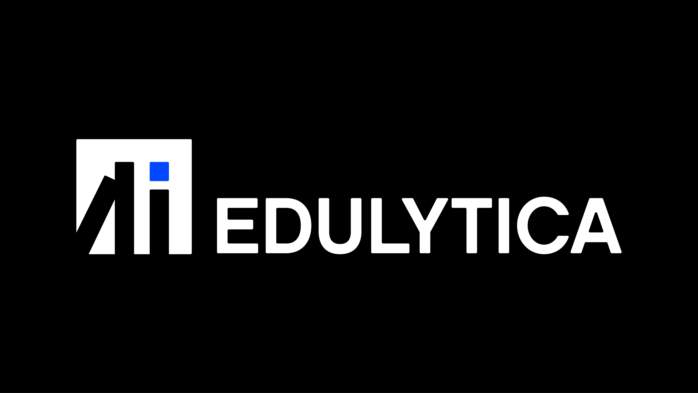

[](https://badgen.net/static/license/MIT/blue)
[](https://www.python.org/)
[](https://codecov.io/gh/LISA-ITMO/Edulytica)


# Edulytica


## Description
The purpose of the application is to automate the analysis of scientific and educational documents in the context of 
research works using LLM (Large language model, large language models) to reduce the time and intellectual costs of 
teachers. The result is two LLMs, trained on specially collected data, capable of summarizing the text of a large 
document and revealing whether the stated goals and objectives of the work have been achieved.

## Features
- Algorithms for summarizing large texts and evaluating the achievement of stated goals and objectives;
- Fast APP is an application for interacting with trained models;
- Separate models have been trained to [summarize](https://huggingface.co/slavamarcin/saiga_llama3_8b-qdora-4bit_purpose) 
and [assess the achievability of goals and objectives](https://huggingface.co/slavamarcin/saiga3_8b_Qdora_4bit_sum);
- Datasets have been prepared for training models, separately for [summarization](https://huggingface.co/datasets/slavamarcin/sum_dataset_v1), 
separately for [goals and objectives](https://huggingface.co/datasets/slavamarcin/purpose_dataset_v1).
> Please help us improve this project, share your feedback with [opening issue](https://github.com/LISA-ITMO/Edulytica/issues)!

## Installation
#### 1. Clone the repository 
```git clone https://github.com/LISA-ITMO/Edulytica.git```

#### 2. Activate venv
```source ~/PyProject/Edulytica/api_venv/bin/activate```

#### 3. Install requirements
```pip install -r requirements.txt```

#### 4. Start Application
```python3 src/edulytica_api/app.py```

#### 5. Activate Celery
```celery -A src.edulytica_api.celery.tasks worker --loglevel=info -E -P gevent```

#### 6. Run npm
```npm start```

#### 7. Run Celery task
```celery -A src.edulytica_api.celery.tasks flower```

## Getting started
First, you can familiarize yourself with the [examples](https://github.com/LISA-ITMO/Edulytica/tree/development/examples) 
in JSON format of the system's responses to the test sample of works.

When you have managed to launch the service, you can send the documents yourself and get acquainted with the results of 
their verification!

## Documentation
Details of the documentation can be found at the links below:
- **[algorithms](https://github.com/LISA-ITMO/Edulytica/tree/development/src/algorithms)** - part of the task of 
analyzing the text how much it is necessary to change the source text (which is written by AI) so that AI recognition
systems do not recognize AI in this text;
- **[data_handling](https://github.com/LISA-ITMO/Edulytica/tree/development/src/data_handling)** - an auxiliary module
that stores parsers of data and documents for generating datasets;
- **[edulytica_api](https://github.com/LISA-ITMO/Edulytica/tree/development/src/edulytica_api)** - this module stores 
the source code of the web service;
- **[extracting_rules](https://github.com/LISA-ITMO/Edulytica/tree/development/src/extracting_rules)** - This module is
devoted to an experiment with extracting design rules using LLM;
- **[rag](https://github.com/LISA-ITMO/Edulytica/tree/development/src/rag)** - Package for an experiment with semantic
search, kNN and the mBERT model are used.

Code documentation is available at [the link](https://lisa-itmo.github.io/Edulytica/index.html).

## Requirements
For more information, see the file **[requiremets.txt](https://github.com/LISA-ITMO/Edulytica/blob/development/requirements.txt)**.

## Contacts
Our contacts:
- Martsinkevich Viacheslav, slavamarcin@yandex.ru;
- Tereshchenko Vladislav, vlad-tershch@yandex.ru;
- Aminov Natig, natig.aminov@gmail.com.

## Conferences
1) XIII Конгресс молодых ученых ИТМО:
   - Дворников А.С., Стрижов Д.А., Унтила А.А., Федоров Д.А. ИССЛЕДОВАНИЕ СГЕНЕРИРОВАННОГО ТЕКСТА НА ПРЕДМЕТ РАСПОЗНАВАНИЯ ИЗМЕНЕНИЙ СЕРВИСАМИ ИДЕНТИФИКАЦИИ ИСКУССТВЕННОГО ИНТЕЛЛЕКТА - 2024;
   - Мищенко М.Ю., Мустафин Д.Э., Унтила А.А. Оценка релевантности неструктурированных данных для анализа и дообучения LLM - 2024;
   - Маракулин А.А., Дедкова А.В., Аминов Н.С., Федоров Д.А. СРАВНИТЕЛЬНЫЙ АНАЛИЗ МЕТОДОВ PEFT ДЛЯ ДООБУЧЕНИЯ БОЛЬШИХ ЯЗЫКОВЫХ МОДЕЛЕЙ - 2024;
   - Богданов М.А., Никифоров М.А., Аминов Н.С., Терещенко В.В., Федоров Д.А. АНАЛИЗ БОЛЬШИХ ДОКУМЕНТОВ ПРИ ПОМОЩИ БОЛЬШИХ ЯЗЫКОВЫХ МОДЕЛЕЙ - 2024;
2) 53 конференция ППС:
   - Мустафин Д.Э., Крылов М.М., Терещенко В.В.ХРАНЕНИЕ ГЕТЕРОГЕННЫХ ДАННЫХ ДЛЯ ИХ ПОСЛЕДУЮЩЕЙ ОБРАБОТКИ - 2023;
   - Богданов М.А., Терещенко В.В., Аминов Н.С.ПРЕДВАРИТЕЛЬНЫЙ АНАЛИЗ ДОКУМЕНТОВ УЧЕБНОГО ПРОЦЕССА ДЛЯ ПОСЛЕДУЮЩЕГО ИХ ТЕМАТИЧЕСКОГО МОДЕЛИРОВАНИЯ - 2023;
   - Синюков Л.В., Лаптев Е.И., Терещенко В.В.ОЦЕНКА ВЛИЯНИЯ ОБРАЗОВАТЕЛЬНЫХ ДИСЦИПЛИН НА РЕЗУЛЬТАТ КУРСОВЫХ РАБОТ С ИСПОЛЬЗОВАНИЕМ ТЕМАТИЧЕСКОГО МОДЕЛИРОВАНИЯ - 2023;
   - Дворников А.С., Стрижов Д.А., Аминов Н.С. РАЗРАБОТКА LLM-МОДЕЛИ КЛАССИФИКАЦИИ ТЕКСТА С ЦЕЛЬЮ АВТОМАТИЧЕСКОГО ОПРЕДЕЛЕНИЯ ДОКУМЕНТА, НАПИСАННОГО ИСКУССТВЕННЫМ ИНТЕЛЛЕКТОМ - 2023.

## Authors
[Tereshchenko Vladislav](https://github.com/Vl-Tershch)\
[Martsinkevich Viacheslav](https://github.com/slavamarcin)\
[Aminov Natig](https://github.com/natigaminov)\
[Mischenko Maxim](https://github.com/L33tl)\
[Bogdanov Maxim](https://github.com/exPriceD)\
[Dvornikov Artem](https://github.com/DvornikovArtem)\
[Laptev Egor](https://github.com/EgorLaptev)\
[Sinyukov Lev](https://github.com/MrL013)