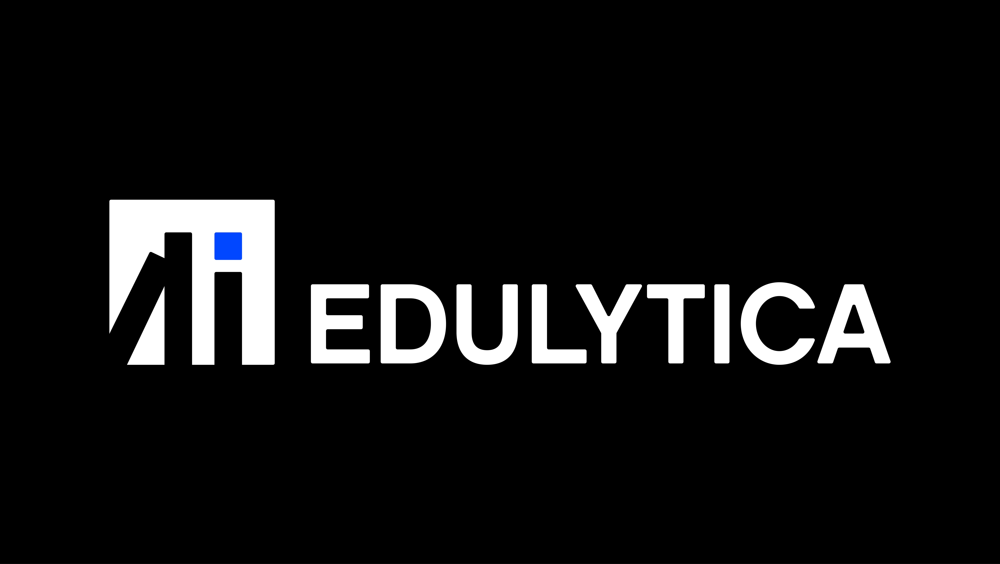
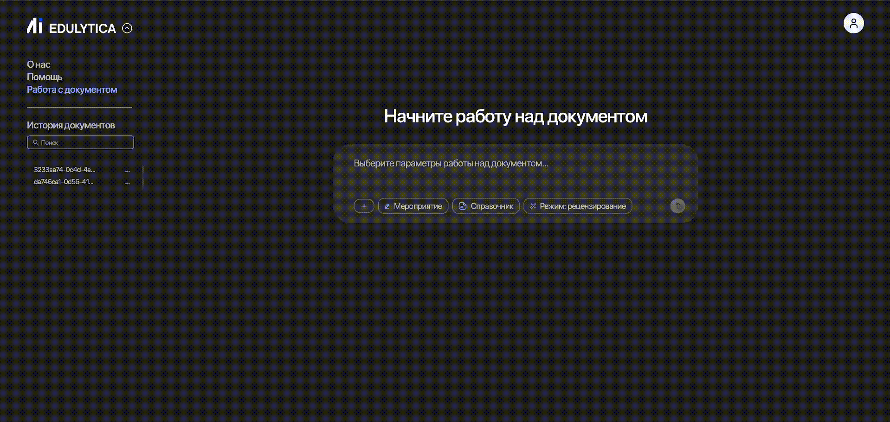

[](https://badgen.net/static/license/MIT/blue)
[](https://visitorbadge.io/status?path=https%3A%2F%2Fgithub.com%2Faimclub%2FEdulytica)
[](https://codecov.io/gh/aimclub/Edulytica)


<p>Built with:</p>

[](https://www.python.org/)


# Edulytica


# About the Project

## Description
Edulytica is an open-source LLM-based framework for automatic evaluating scientific and educational texts. 
It provides an integrated web application out of the box capable for extraction all vital information from a given text, such as
its goals and objectives, scientific novelty, theoretical and applied significance, connections with similar texts.
The result of such an analysis is a natural language review text. 

A general-purpose AI model (e.g., Llama 3) does not "know" the specific criteria of particular scientific 
events (conferences, journals, or university departments). In Edulytica this issue is addressed by a specific module RAG
(Retrieval-Augmented Generation). It is an architectural solution that allows a Large Language Model 
(LLM) to utilize external, up-to-date knowledge not included in its initial training data. At the moment,
Edulytica RAG supports five events:
- ITMO University Congress of Young Scientists
- ITMO University Faculty Scientific and Educational-Methodological Conference
- Young Scientists Conference on Computational Sciences
- Framework for Research in Ubiquitous Communication Technologies (FRUCT) Сonference
- Economics. Management. Innovation journal

## Goals 
The project is aimed at supporting experts in reviewing theses and articles, potentially complete automation of the reviewing process.
Another goal is reducing of time required for in-depth analysis of papers by scientists during their literature reviews and thus 
acceleration of the research.

## Features
Current implemented features include:
- The extraction of goals and objectives from the text of the introduction of final qualifying papers;
- Forming a primary review as part of the work with scientific articles;
- Algorithms for summarizing large texts and evaluating the achievement of stated goals and objectives;
- A web application for interacting with features and trained LLMs through a user-friendly interface.

Separate models have been trained to [summarize](https://huggingface.co/slavamarcin/saiga_llama3_8b-qdora-4bit_purpose) 
and [assess the achievability of goals and objectives](https://huggingface.co/slavamarcin/saiga3_8b_Qdora_4bit_sum).
Datasets have been prepared for training models, separately for [summarization](https://huggingface.co/datasets/slavamarcin/sum_dataset_v1), 
separately for [goals and objectives](https://huggingface.co/datasets/slavamarcin/purpose_dataset_v1).
> Please help us improve this project, share your feedback with [opening issue](https://github.com/aimclub/Edulytica/issues)!

# Technology Stack
The project uses the following technologies.

**Programming language**: Python 3.12. 

**Frontend**: HTML, JavaScript, React, Axios.

**Backend**: FastAPI, Sqlalchemy, Pydantic, Uvicorn, Asyncio, Alembic.

**Database**: PostgreSQL.

**Hosting**: ??? 

**Containerisation**: Docker Compose.

**Large-language models**: **Kafka ???**

# Architecture 
The Edulytica framework is built on a modular and service-oriented architecture 
tailored for AI-driven applications. This design ensures strict separation of concerns, 
scalability, and seamless integration of LLM components.The system comprises six core 
modules, each managing a specific domain of the application workflow:

- **Frontend**: The client-side user interface. It manages user interactions, renders data, 
dispatches requests to the API, and displays AI-generated responses.
- **API**: The framework's API Gateway powered by FastAPI. It serves as the single entry 
point for the frontend, routing requests, handling data streaming, and enforcing strict 
input validation.
- **Auth**: The security layer. Responsible for user authentication and authorization 
(e.g., JWT token lifecycle), role-based access control, and endpoint protection.
- **Orchestration**: The core business logic controller. It manages multistep execution 
workflows, coordinates interactions between the API, knowledge base (RAG), and language 
models, and maintains session states.
- **RAG (Retrieval-Augmented Generation)**: The context extraction engine. It handles 
document parsing, embedding generation, vector database management, and semantic search 
to inject relevant context into prompt payloads (see src/rag/README.md for more detail).
- **Models**: The AI abstraction layer. It provides unified interfaces and configurations 
for interacting with Large Language Models (LLMs) and embedding models, supporting both 
external APIs and locally hosted instances.

# Deployment 
## Prerequisites 
Before running Edulytica, ensure you have the following software 
installed on your host machine:

* **Docker** (Version 20.10 or higher)
* **Nvidia drivers** (Compatible with your GPU)
* **Nvidia Container Toolkit** (To enable GPU acceleration inside the container)

**Warning!** The project does not work with GPUs other than Nvidia. 

## Installation
#### 1. Clone the repository 
```git clone https://github.com/aimclub/Edulytica.git```

#### 2. Create venv
```python3 -m venv .venv```

#### 3. Activate venv
```source .venv/bin/activate```

#### 3. Install requirements
```pip install -r requirements.txt```

#### 4. Setup .env
```cp .env-template .env```

#### 5. Launch docker containers or follow the instructions starting from point 6
```docker compose up --build```

#### 6. Start Application
```python3 src/edulytica_api/app.py```

#### 7. Activate Celery
```celery -A src.edulytica_api.celery.tasks worker --loglevel=info -E -P gevent```

#### 8. Run npm
```npm start```

#### 9. Run Celery task
```celery -A src.edulytica_api.celery.tasks flower```

## Setup
After installation the project is ready to work as is. However, you can
further set up the .env file according to the comments in .env-template.

## Getting started


First, you can familiarize yourself with the [examples](https://github.com/aimclub/Edulytica/tree/development/examples) 
in JSON format of the system's responses to the test sample of works.

When you have managed to launch the service, you can send the documents yourself and get acquainted with the results of 
their verification!

## Events inside the web application
As part of working with RAG technology, the specifics of the following measures are taken into account when generating 
a response from the system:
1. kmu_event - suitable for articles by undergraduates and graduate students of junior courses submitted to open 
university conferences of young scientists, language - Russian;
2. epi_event - suitable for "adult" articles in the field of economics, management in organizational systems and 
related fields, language - Russian;
3. ysc_event is suitable for articles by young scientists that are submitted to Web of Science or Scopus journals, 
conferences with the publication of works in Web of Science or Scopus publications on advanced computer science, 
including artificial intelligence, language - English;
4. fruct_event - suitable for articles by young scientists that are submitted to Web of Science or Scopus journals, 
conferences with the publication of papers in Web of Science or Scopus publications on computer science (may include 
work in the field of applied artificial intelligence), language - English;
5. pps_event - suitable for articles by students, graduate students, and young teachers submitted to open university 
educational and methodological conferences, the language is Russian.

Choosing an event at the stage of sending a document is **mandatory** and affects the quality of the response generated.

# Publications about Edulytica
We also published several posts devoted to different aspects of the project:

In Russian:
- [Edulytica: LLM-ассистент для проверки научных работ](https://youtu.be/kDNREVv1IoI?si=lDzHTxTh333EcSaZ) - Scientific Open Source Meetup №8, October 2024, 1:05:15 - 1:22:36;
- [Как мы научили LLM-ассистента рецензировать научные работы студентов ИТМО: вновь о проекте Edulytica](https://vkvideo.ru/video-173944682_456239041) - Scientific Open Source Meetup №10, July 2025, 1:07:30 - 1:34:00.

## Documentation
Details of the documentation can be found at the links below:
- **[algorithms](https://github.com/aimclub/Edulytica/tree/development/src/algorithms)** - part of the task of 
analyzing the text how much it is necessary to change the source text (which is written by AI) so that AI recognition
systems do not recognize AI in this text (NOT FOUND);
- **[data_handling](https://github.com/aimclub/Edulytica/tree/development/src/data_handling)** - an auxiliary module
that stores parsers of data and documents for generating datasets (NOT FOUND);
- **[edulytica_api](https://github.com/aimclub/Edulytica/tree/development/src/edulytica_api)** - this module stores 
the source code of the web service;
- **[extracting_rules](https://github.com/aimclub/Edulytica/tree/development/src/extracting_rules)** - This module is
devoted to an experiment with extracting design rules using LLM (NOT FOUND);
- **[rag](https://github.com/aimclub/Edulytica/tree/development/src/rag)** - Package for an experiment with semantic
search, kNN and the mBERT model are used.

Code documentation is available at [the link](https://aimclub.github.io/Edulytica/index.html).

## Contacts
Our contacts:
- Project Lead: Vladislav Tereshchenko — vvtereshchenko@itmo.ru

[//]: # (## Requirements)

[//]: # (For more information, see the file **[requiremets.txt]&#40;https://github.com/aimclub/Edulytica/blob/development/requirements.txt&#41;**.)