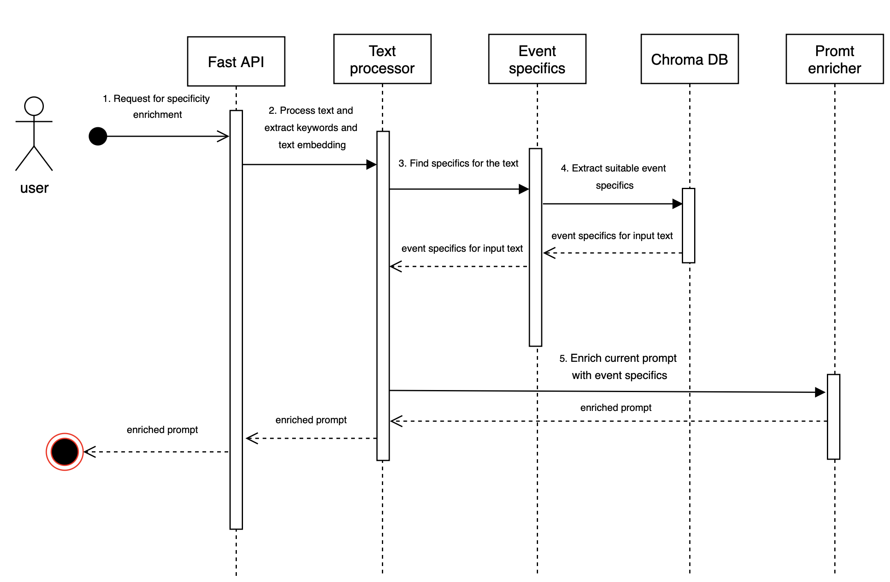

# RAG (Retrieval-Augmented Generation)

---
Package for RAG.

---
## Table of Contents
- [System Architecture](#system-architecture)
- [System Components](#system-components)
- [Data Flow](#data-flow)

## System Architecture

## System Components

The RAG system consists of the following main components:

1. **Fast API** - Entry point to the system, provides a REST API for receiving prompt enrichment requests.

2. **Text Processor** - Responsible for processing input text, extracting keywords, and preparing embeddings.

3. **Event Specifics** - Finds specifics for the text, matching the request with a particular event type.

4. **Chroma DB** - Vector database for storing and retrieving information about events.

5. **Prompt Enricher** - Enriches the original prompt with additional event-specific information.

## Data Flow

1. The user sends an enrichment request via Fast API
2. Text Processor processes the text, extracts keywords, and creates embeddings
3. Event Specifics analyzes the text and finds appropriate specifications for it
4. Chroma DB extracts suitable event specifics from the vector storage
5. Prompt Enricher enhances the original prompt with event-specific information
6. The enriched prompt is returned to the user

---
